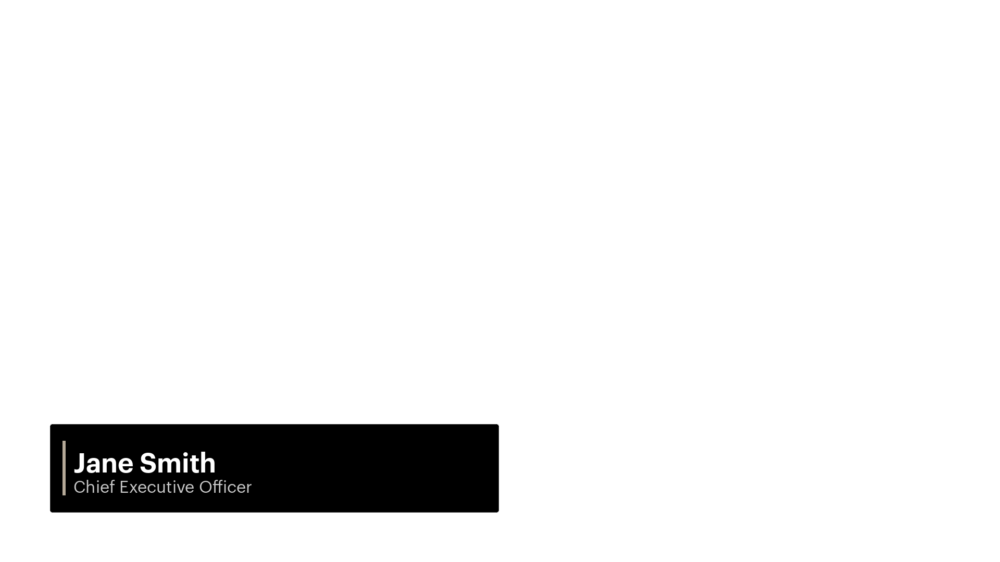

# FaireL3s

**v0.0.3**

Generate Faire-style lower-third graphics (1920×1080 transparent PNGs) for video. Name + title on a light panel with accent bar.

## Pick a style 

Use the theme name with `--theme` when you run the script (e.g. `--theme dark`).

| Style | Theme name | Preview |
|-------|------------|---------|
| **Default** (light warm) | `default` |  |
| **Dark** (#333 panel) | `dark` |  |
| **Dark alt** (black panel) | `dark_alt` |  |
| **Bright** (sage green) | `bright` |  |
| **Bright Insider** (teal) | `bright_insider` |  |
| **Bright Warm** (amber) | `bright_warm` |  |
| **Bright Info** (slate blue-gray) | `bright_info` |  |

## Requirements

- Python 3.9+
- [Pillow](https://pypi.org/project/Pillow/) (`pip install pillow`)

## Fonts (required for correct look)

Faire uses two core brand typefaces:

- **Graphik** (sans-serif) for most product UI and general readability.<sup>[1]</sup>
- **Nantes** (serif) for “brand voice” moments (e.g. marketing).<sup>[2]</sup>

This script uses **Graphik** for both the name and title lines (SemiBold/Medium for the name, Regular for the title). The iOS codebase bundles Graphik (Regular, Medium, SemiBold) and Nantes (Regular, SemiBold).<sup>[3]</sup>

**This repo does not include font files.** Use one of the options below.

### Option A: Brand fonts (Graphik) — internal

Faire hosts Graphik on the CDN for internal use.<sup>[4]</sup> You can pull the fonts automatically so the script uses the real brand typeface.

**Step 1 — Fetch the fonts**

From the repo directory (where `generate_lowerthirds.py` lives), run:

```bash
python3 generate_lowerthirds.py --fetch-fonts
```

This step:

- Downloads three font files from **cdn.faire.com** (Graphik Regular, Medium, SemiBold)
- Saves them into the **`font/`** folder as `Graphik-Regular.otf`, `Graphik-Medium.otf`, `Graphik-SemiBold.otf`
- Requires **network access** (and works only from environments that can reach Faire’s CDN)

The CDN may require you to be on Faire’s network or VPN; if the download fails (e.g. 403 or connection error), try from a Faire-connected machine or use [Option B](#option-b-inter-substitute-for-graphik) (Inter) instead. No separate login or credentials are used—access is typically governed by network/VPN.

You only need to run `--fetch-fonts` once per machine (or after deleting `font/`). The script does not generate any lower thirds in this step; it only downloads the fonts and then exits.

**Step 2 — Generate lower thirds**

After the fonts are in `font/`, run the script as usual (see [Usage](#usage)). It will use Graphik automatically.

If you already have the Graphik files from another source, put them in **`font/`** or **`fonts/`** with the same names; no need to run `--fetch-fonts`.

### Option B: Inter (substitute for Graphik)

Inter is a good stand-in for Graphik. Easiest: download **[Inter from Google Fonts](https://fonts.google.com/specimen/Inter)** → “Download family”, unzip, and put the unzipped folder next to the script as **`Inter`**. The script looks in `Inter/` and `Inter/static/` for the font files.

Or put only the two needed files in **`font/`** or **`fonts/`**:

- Name line: `Inter-SemiBold.ttf` or `Inter-Bold.ttf`
- Title line: `Inter-Regular.ttf`

### Verify

Run a single lower third. If the name is bold and the title is regular, fonts are set up correctly:

```bash
python3 generate_lowerthirds.py --name "Your Name" --title "Your Title" --out output/test.png
```

## Usage

**One lower third:**

```bash
python3 generate_lowerthirds.py --name "Jane Smith" --title "Chief Executive Officer" --out output/lowerthird_jane_smith.png
```

**Batch from CSV:**

```bash
python3 generate_lowerthirds.py --csv example_people.csv --out_dir output/
```

Create the `output/` directory first if it doesn’t exist. CSV format: header row `name,title`, then one row per person. Use quotes for titles that contain commas.

**Note:** The script overwrites existing files. If a PNG with the same path already exists (e.g. `output/lowerthird_jane_smith.png`), it will be replaced. Use a different `--out` path or `--out_dir` if you want to keep previous output.

```csv
name,title
Jane Smith,Chief Executive Officer
Alex Chen,Chief Technology Officer
```

### Themes (Faire brand colorways)

Use `--theme` with the theme name from the table above. All colors come from the Faire design language.

**Examples:**

```bash
python3 generate_lowerthirds.py --name "Jane Smith" --title "Chief Executive Officer" --out output/jane_dark.png --theme dark
python3 generate_lowerthirds.py --csv example_people.csv --out_dir output/ --theme bright
```

Batch output filenames get a theme suffix when not default (e.g. `lowerthird_jane_smith_dark.png`) so you can generate multiple themes into the same folder.

## Customization

Edit `style.json` (or `style_dark.json`, `style_bright.json`, etc.) to change layout and colors: panel size, margins, text sizes, accent bar, etc.

## Output

- **Size:** 1920×1080  
- **Format:** PNG with transparency  
- **Layout:** Lower-left panel, name (semi-bold) above title (regular)

A sample lower third is included as **`output/example_lowerthird.png`** (Jane Smith, Chief Executive Officer) so you can see the result without running the script.

---

<sup>[1]</sup> [Faire Slack – Graphik](https://faire-wholesale.slack.com/archives/CC5448WAG/p1759868613384409)  
<sup>[2]</sup> [Faire Slack – Nantes](https://faire-wholesale.slack.com/archives/C07QYV5FQET/p1731709269836909)  
<sup>[3]</sup> [Faire iOS – UIFont+Faire](https://github.com/Faire/ios/blob/main/Modules/ViewCore/Sources/Extensions/UIFont+Faire.swift)  
<sup>[4]</sup> [Faire Slack – CDN fonts](https://faire-wholesale.slack.com/archives/C08H6DAB5TM/p1747315159424589) (Graphik on cdn.faire.com)
